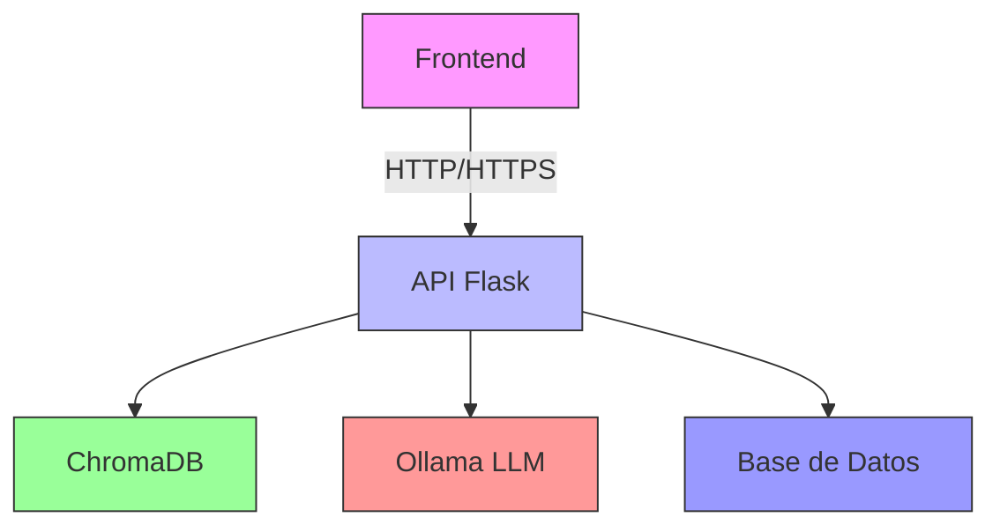

# Documentación Técnica Completa

> **Fecha**: 20/06/2025  
> **Versión**: 1.0  
> **Autor**: Equipo de Desarrollo

## Visión General

Este documento integra la documentación completa del sistema CommerIA, incluyendo tanto el backend como el frontend. El sistema está diseñado para proporcionar un asistente de ventas inteligente con capacidades de procesamiento de lenguaje natural y visualización de datos.

---

## Tabla de Contenido
1. [Arquitectura del Sistema](#arquitectura-del-sistema)
2. [Instalación y Configuración](#instalación-y-configuración)
   - [Requisitos del Sistema](#requisitos-del-sistema)
   - [Configuración del Entorno](#configuración-del-entorno)
3. [Uso con Ollama](#uso-con-ollama)
   - [Configuración del Modelo](#configuración-del-modelo)
   - [Optimización de Rendimiento](#optimización-de-rendimiento)
4. [Backend](#backend)
   - [Estructura del Proyecto](#estructura-backend)
   - [Endpoints Principales](#endpoints-principales)
   - [Base de Datos](#base-de-datos)
5. [Frontend](#frontend)
   - [Estructura del Proyecto](#estructura-frontend)
   - [Componentes Principales](#componentes-principales)
   - [Gestión de Estado](#gestión-de-estado)
6. [Despliegue](#despliegue)
   - [Entornos](#entornos)
   - [Variables de Entorno](#variables-de-entorno)
7. [Solución de Problemas](#solución-de-problemas)
   - [Errores Comunes](#errores-comunes)
   - [Preguntas Frecuentes](#preguntas-frecuentes)

---

<a name="instalación-y-configuración"></a>
## 1. Instalación y Configuración

### Requisitos del Sistema

#### Backend
- Python 3.11+
- pip (última versión)
- Ollama (para ejecución local de modelos)
- ChromaDB (almacenamiento vectorial)
- Memoria: Mínimo 8GB RAM (16GB recomendado para desarrollo)
- Espacio en disco: 2GB libres (más espacio para modelos)

#### Frontend
- Node.js 18+
- npm o yarn
- Navegador web moderno (Chrome, Firefox, Edge)

### Configuración del Entorno

#### Backend (Python)
```bash
# Crear entorno virtual (Windows/Linux/Mac)
python -m venv venv

# Activar entorno (Windows)
.\venv\Scripts\activate
# Linux/Mac
# source venv/bin/activate

# Actualizar pip e instalar dependencias
python -m pip install --upgrade pip
pip install -r requirements.txt

# Configurar variables de entorno (crear archivo .env)
CHROMA_HOST=localhost        # Host de ChromaDB
CHROMA_PORT=8000            # Puerto de ChromaDB
OPENAI_API_KEY=opcional      # Solo si usas OpenAI en lugar de Ollama
FLASK_ENV=development       # Entorno de ejecución
FLASK_APP=server/v3.py      # Punto de entrada de la aplicación
PORT=3009                   # Puerto del servidor backend
```

#### Frontend (Node.js)
```bash
# Instalar dependencias
cd client
npm install  # o yarn install

# Variables de entorno (crear archivo .env en la carpeta client)
REACT_APP_API_URL=http://localhost:3009  # URL del backend
NODE_ENV=development                    # Entorno de desarrollo
```

### Frontend (Node.js)
```bash
cd client
npm install  # o yarn install
```

---

<a name="uso-con-ollama"></a>
## 2. Uso con Ollama

Ollama permite ejecutar modelos de lenguaje localmente, lo que mejora la privacidad y reduce los costos de API. Esta sección detalla cómo configurar y optimizar Ollama para el proyecto.

### Requisitos
- [Ollama](https://ollama.ai/) instalado en tu sistema
- Modelo de lenguaje compatible (recomendado: `llama3` o `mistral`)
- Mínimo 8GB de RAM (16GB+ recomendado para mejores resultados)
- Conexión a Internet para la descarga inicial del modelo

### Instalación de Modelos

Para instalar un modelo en Ollama:

```bash
# Instalar el modelo (ej: llama3)
ollama pull llama3

# Ver modelos instalados
ollama list

# Ejecutar el modelo en modo chat
ollama run llama3
```

### Configuración del Backend para Ollama

En `server/v3.py`, configura la inicialización del modelo:

```python
from langchain_ollama.llms import OllamaLLM

# Inicialización del modelo
model = OllamaLLM(
    model="llama3",  # o el modelo que prefieras
    temperature=0.7,  # Controla la creatividad (0-1)
    num_ctx=4096,    # Tamaño del contexto
    num_gpu=1,       # Usar GPU si está disponible
)
```

### Optimización de Rendimiento

1. **Ajuste de Parámetros**
   - `temperature`: Valores más bajos (0.1-0.3) para respuestas más deterministas, más altos (0.7-1.0) para mayor creatividad.
   - `num_ctx`: Aumenta para conversaciones más largas, pero consume más memoria.
   - `num_gpu`: Configura el número de GPUs a utilizar.

2. **Caché de Modelo**
   Ollama almacena modelos en `~/.ollama`. Asegúrate de tener suficiente espacio en disco.

3. **Versión del Modelo**
   Especifica versiones específicas para consistencia:
   ```bash
   ollama pull llama3:8b-instruct-q4_0
   ```

4. **Variables de Entorno**
   ```bash
   # Limitar el uso de memoria de Ollama (en MB)
   OLLAMA_MAX_LOADED_MODELS=2
   OLLAMA_NUM_GPU=1
   ```

### Integración con el Chatbot

El frontend se comunica con el backend a través de la API `/chat`. No se requieren cambios en el frontend para usar Ollama, ya que toda la lógica de procesamiento de lenguaje natural se maneja en el backend.

### Solución de Problemas Comunes

1. **Modelo no responde**
   - Verifica que Ollama esté en ejecución: `ollama serve`
   - Revisa los logs del servidor para errores
   - Prueba el modelo directamente: `ollama run llama3`

2. **Rendimiento lento**
   - Reduce el tamaño del contexto (`num_ctx`)
   - Usa un modelo más pequeño (ej: `llama3:7b` en lugar de `llama3:70b`)
   - Asegúrate de que la GPU esté siendo utilizada

3. **Problemas de memoria**
   - Reduce el número de modelos cargados simultáneamente
   - Cierra aplicaciones que consuman mucha memoria
   - Considera usar un modelo más pequeño

### Recursos Adicionales
- [Documentación Oficial de Ollama](https://github.com/jmorganca/ollama)
- [Modelos Disponibles](https://ollama.ai/library)
- [Guía de Optimización](https://github.com/jmorganca/ollama/blob/main/docs/advanced.md)

### Pasos para ejecutar con Ollama

1. **Iniciar el servidor de Ollama** (en una terminal aparte):
   ```bash
   ollama serve
   ```

2. **Configurar el backend** para usar Ollama:
   - Modificar `server/v3.py` (o el archivo correspondiente):
     ```python
     # Reemplazar la inicialización de LLM por:
     from langchain_community.llms import Ollama
     llm = Ollama(model="llama3")  # Ajustar según el modelo descargado
     ```

3. **Iniciar el backend** (puerto 3009):
   ```bash
   uvicorn server.v3:app --reload --port 3009
   ```

4. **Iniciar el frontend** (puerto 3000):
   ```bash
   cd client
   npm start
   ```

> **Nota**: Asegúrate de que las URLs del frontend apunten correctamente al puerto del backend (3009).

---

<a name="backend"></a>
## 3. Backend

El backend de CommerIA está construido con Python y Flask, proporcionando una API RESTful para el frontend. Utiliza ChromaDB para el almacenamiento vectorial y Ollama para el procesamiento de lenguaje natural.

### Arquitectura General



### Flujo de Datos

1. **Recepción de Peticiones**: El servidor Flask recibe peticiones HTTP del frontend
2. **Procesamiento**: Se procesa la solicitud y se interactúa con los servicios necesarios
3. **Respuesta**: Se devuelve una respuesta JSON al frontend

### Características Clave

- **Arquitectura Modular**: Código organizado en módulos por funcionalidad
- **Escalable**: Diseñado para manejar múltiples solicitudes concurrentes
- **Seguro**: Implementa validación de entrada y manejo de errores
- **Documentado**: Código con documentación detallada

<a name="endpoints-principales"></a>
### Endpoints Principales

#### `GET /productos`

- **Archivo**: `server/app.py`
- **Método**: GET
- **Descripción**: Obtiene la lista de productos disponibles en el sistema
- **Parámetros**: Ninguno
- **Ejemplo de solicitud**:
  ```http
  GET /productos
  ```
- **Respuesta exitosa (200 OK)**:
  ```json
  [
    {
      "id": 1,
      "nombre": "Producto 1",
      "categoria": "electrónica",
      "precio": 299.99,
      "stock": 50,
      "descripcion": "Descripción detallada del producto"
    },
    {
      "id": 2,
      "nombre": "Producto 2",
      "categoria": "hogar",
      "precio": 149.99,
      "stock": 25,
      "descripcion": "Otra descripción de producto"
    }
  ]
  ```
- **Códigos de error**:
  - 500: Error interno del servidor

**Implementación en Python**:
```python
@app.route('/productos', methods=['GET'])
def get_productos():
    """
    Obtiene la lista de productos del sistema.
    
    Returns:
        Response: Lista de productos en formato JSON
    """
    try:
        # Lógica para obtener productos desde la base de datos
        productos = obtener_productos_desde_db()
        return jsonify(productos), 200
    except Exception as e:
        app.logger.error(f"Error al obtener productos: {str(e)}")
        return jsonify({"error": "Error al obtener los productos"}), 500

#### `POST /chat`

- **Archivo**: `server/v3.py`
- **Método**: POST
- **Descripción**: Procesa los mensajes del usuario y genera respuestas utilizando el modelo de lenguaje. Este es el endpoint principal para la interacción con el chatbot.

**Parámetros del Cuerpo (JSON)**:

| Parámetro | Tipo   | Requerido | Descripción                                  |
|-----------|--------|-----------|----------------------------------------------|
| message   | string | Sí        | El mensaje del usuario a procesar            |
| userId    | string | No        | Identificador único del usuario (opcional)   |
| context   | object | No        | Contexto adicional de la conversación        |


**Ejemplo de Solicitud**:
```http
POST /chat
Content-Type: application/json

{
  "message": "Hola, necesito ayuda con un producto",
  "userId": "usr_12345",
  "context": {
    "ultimoProductoVisto": "smartphone-x",
    "esClienteFrecuente": true
  }
}
```

**Respuesta Exitosa (200 OK)**:
```json
{
  "response": "¡Hola! Estoy aquí para ayudarte. ¿Sobre qué producto necesitas información?",
  "mostrar_formulario": false,
  "intencion": "saludo",
  "sugerencias": [
    "Ver catálogo",
    "Consultar precios",
    "Hablar con un asesor"
  ],
  "metadata": {
    "timestamp": "2025-06-20T16:30:45Z",
    "modelo_utilizado": "llama3-8b",
    "tiempo_respuesta_ms": 450
  }
}
```

**Códigos de Error**:
- 400: Solicitud incorrecta (faltan parámetros requeridos)
- 429: Demasiadas solicitudes (rate limiting)
- 500: Error interno del servidor

**Implementación en Python**:
```python
@app.route('/chat', methods=['POST'])
def obtener_respuesta():
    """
    Procesa el mensaje del usuario y genera una respuesta utilizando el modelo de lenguaje.
    
    Returns:
        Response: Respuesta en formato JSON que incluye la respuesta del asistente
                 y banderas para acciones adicionales.
    """
    try:
        data = request.get_json()
        mensaje = data.get('message')
        usuario_id = data.get('userId', str(uuid.uuid4()))
        
        if not mensaje:
            return jsonify({"error": "El campo 'message' es requerido"}), 400
            
        # Procesar el mensaje con el modelo de lenguaje
        respuesta = procesar_mensaje(mensaje, usuario_id)
        
        # Registrar la interacción
        registrar_interaccion(usuario_id, mensaje, respuesta)
        
        return jsonify({
            "response": respuesta,
            "mostrar_formulario": debe_mostrar_formulario(respuesta),
            "usuario_id": usuario_id
        })
        
    except Exception as e:
        app.logger.error(f"Error en /chat: {str(e)}")
        return jsonify({"error": "Error al procesar la solicitud"}), 500

def procesar_mensaje(mensaje: str, usuario_id: str) -> str:
    """
    Procesa el mensaje del usuario utilizando el modelo de lenguaje.
    
    Args:
        mensaje (str): Mensaje del usuario
        usuario_id (str): Identificador único del usuario
        
    Returns:
        str: Respuesta generada por el modelo
    """
    # Detectar intención del usuario
    intencion = detectar_intencion(mensaje)
    
    # Obtener contexto relevante
    contexto = obtener_contexto(usuario_id, intencion)
    
    # Generar prompt con el contexto
    prompt = generar_prompt(mensaje, contexto, intencion)
    
    # Obtener respuesta del modelo
    respuesta = model.generate([prompt])
    
    return respuesta[0].text if respuesta else "Lo siento, no pude procesar tu solicitud."
```

**Consideraciones de Rendimiento**:
- El endpoint implementa caché de respuestas para mensajes idénticos
- Se recomienda implementar rate limiting en producción
- Las respuestas pueden variar según el modelo configurado (Ollama u OpenAI)

**Seguridad**:
- Validación de entrada para prevenir inyección de código
- Sanitización de mensajes antes de procesarlos
- Registro de interacciones para monitoreo y mejora

<a name="estructura-backend"></a>
### Estructura de Directorios
```
server/
├── v3.py            # Lógica principal del chat
├── Bot2.py          # Detección de intenciones
├── app.py           # API de productos
└── APIs/
    └── API_productos.py  # Rutas de productos
```

---

<a name="frontend"></a>
## 4. Frontend

<a name="componentes-clave"></a>
### Componentes Clave

#### `TabsPillsExample`
- **Ruta**: `/tabspills`
- **Funcionalidad**: Dashboard principal con pestañas
- **Estado**:
  ```javascript
  {
    activeTab: 1,  // 1=Analytics, 2=Productos, 3=Home
    mainMetrics: [] // Datos para las tarjetas
  }
  ```

#### `Chatbot`
- **Ruta**: Se muestra flotante en todas las páginas
- **Flujo**:
  1. Usuario escribe mensaje
  2. Se envía a `/chat`
  3. Muestra respuesta y/o formulario

<a name="estructura-frontend"></a>
### Estructura de Directorios
```
client/src/
├── Proyecto/         # Componentes principales
├── components/        # Componentes reutilizables
├── views/pages/       # Páginas y gráficos
└── App.js            # Configuración de rutas
```

---

## Solución de Problemas Comunes

### El chatbot no responde
1. Verifica que Ollama esté en ejecución: `ollama list`
2. Revisa la consola del navegador (F12) por errores de CORS
3. Asegúrate de que el backend esté escuchando en el puerto correcto (3009 por defecto)

### Los gráficos no se muestran
1. Verifica la conexión con el backend
2. Revisa la consola del navegador por errores de red
3. Asegúrate de que las rutas de la API en el frontend coincidan con el backend

---

## Recursos Adicionales
- [Documentación de Ollama](https://github.com/jmorganca/ollama)
- [Documentación de LangChain](https://python.langchain.com/docs/)
- [Documentación de React](https://es.reactjs.org/)

---

> **Nota**: Esta documentación asume que estás utilizando Windows. Ajusta los comandos según tu sistema operativo.
